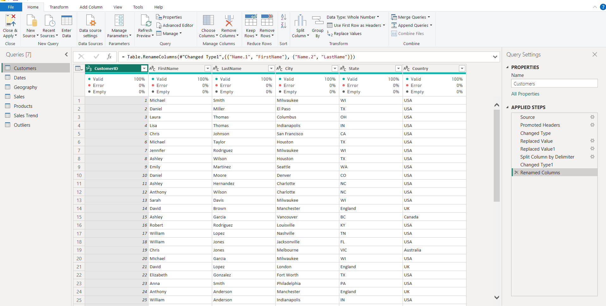
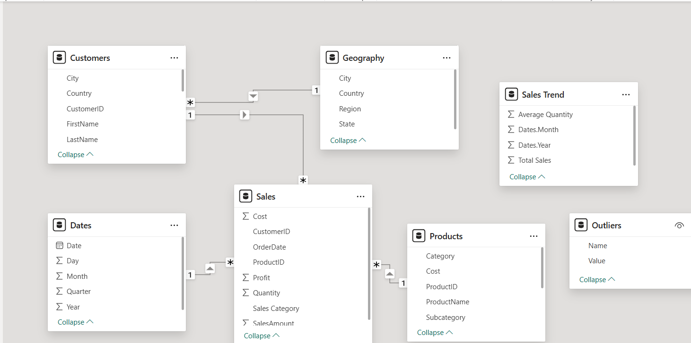
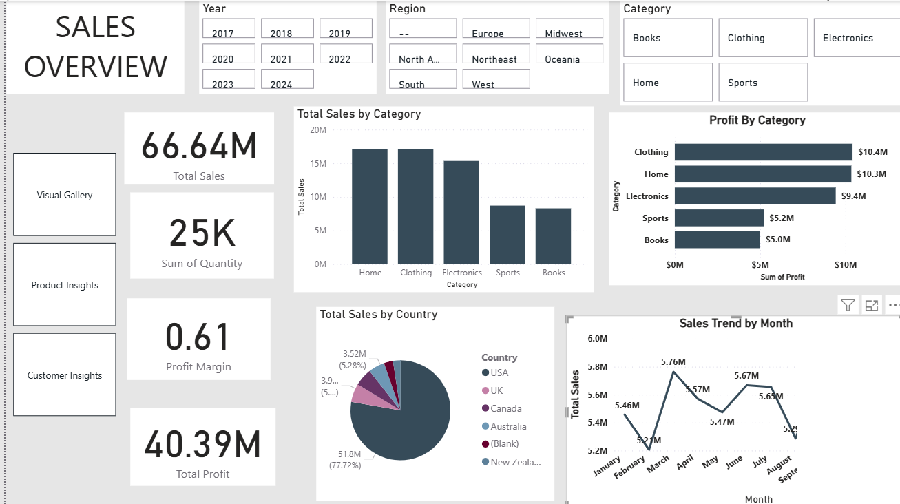
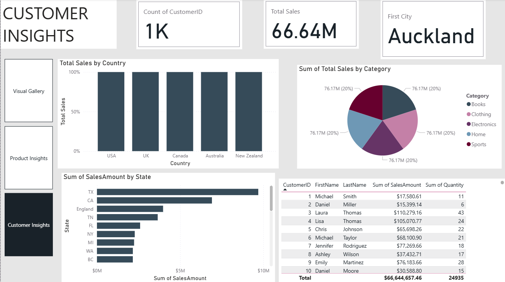
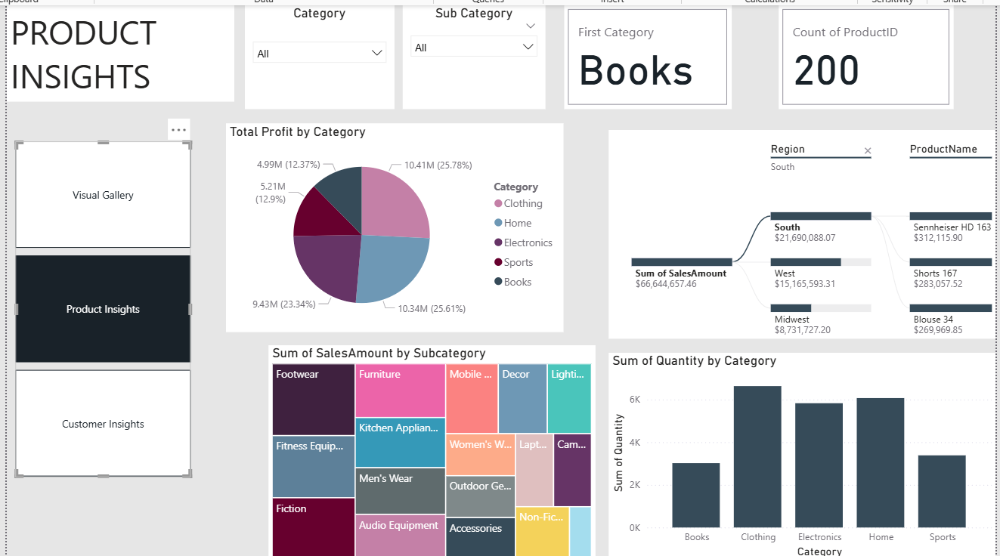
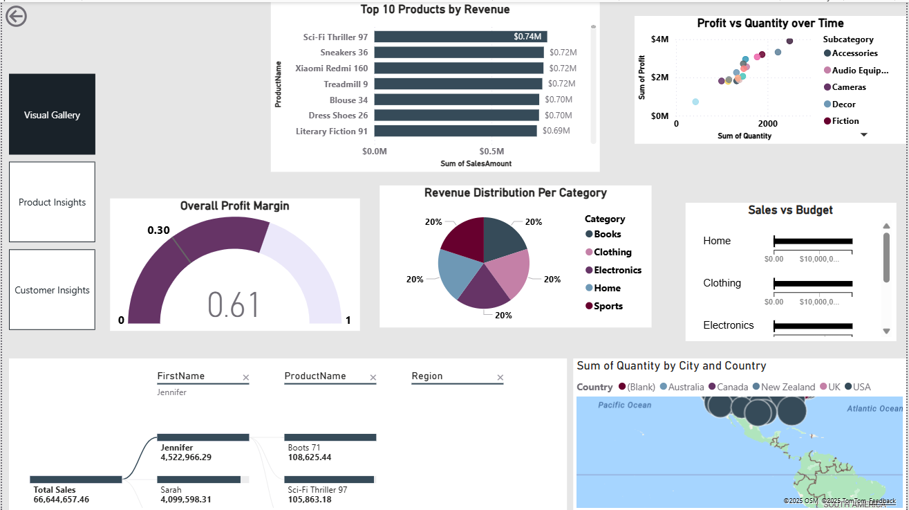

# PowerBI_Practical_Exam_-Daki-

**Description**
Built a Power BI dashboard using simulated sales dataset to analyze revenue, profit, and customer trends. I cleaned the data, modeled relationships, created advanced DAX measures, and designed interactive visuals

Challenges faced

One of the challenges I faced was that the Power BI report link failed to publish, despite multiple attempts. Additionally, some missing numerical values like cost triggered errors during the imputation process, which required me to drill up to a higher-level aggregation to resolve the issue. While the imputation problem was addressed, the publishing issue remained unresolved.

Power bi link

https://app.powerbi.com/groups/me/reports/bbf61047-c5e4-46ac-8e79-d4226c8d4b74/aeee1b859755850d519d?experience=power-bi

Data Cleaning and Transformation
 
The data had some missing values fot the categorical values I replaced the missing values with unknown while for the numerical values are drilled up and down to replace the missing values
Transformations were performed in Power Query — including merging tables sales and product to calculate profit, splitting customer names, filtering records post-2018, adding a colums sales category and finding ooutliers in the data which they were none.

Data Modeling

A star schema was implemented with Sales as the fact table and Dates, Products, Customers, and Geography as dimension tables. Relationships were defined and validated, and hierarchies (e.g., Year > Quarter > Month) were created for intuitive navigation.

Dax Measures
Total Sales = SUM(Sales[SalesAmount])  which Calculates the sum of all sales amounts.

Total Profit which calculates total profit using the calculated column Profit = SalesAmount - (Quantity * Cost)

Profit Margin measures the percentage of sales that is profit.Profit Margin
Profit Margin = DIVIDE([Total Profit], [Total Sales])

Year-over-Year (YoY) Growth compares current period sales to the same period last year.
YoY Growth = 
VAR CurrentSales = [Total Sales]
VAR LastYearSales = CALCULATE([Total Sales], SAMEPERIODLASTYEAR(Dates[Date]))
RETURN DIVIDE(CurrentSales - LastYearSales, LastYearSales)

Visualization & Reporting and Insights
Interactive visuals grouped into customer insights, products insights, sales overview and general gallery were built to explore trends, outliers, and performance metrics. These include time-series line charts with forecasting, scatter plots with play axis, decomposition trees, KPIs, and maps with drill-down.

Sales Overview

Monthly sales range between approximately $5.4 million and $5.95 million, with the peak occurring in December 2023 at around $5.95 million. The lowest recorded month was about $5.21 million indicating relatively stable sales performance throughout the period.

There is a strong positive correlation between quantity sold and profit, with high-volume items consistently generating higher profits. Subcategories such as Fiction, Audio Equipment, and Fitness are key drivers of sales volume.

The Southern U.S. is the strongest market with  $21.69M (32.5% of total sales) suggesting focused marketing.

## Sales Overview Page

Customer Insights

The highest sales region is the South (USA) with $21.69M in total sales, and several top customers like Jennifer Rodriguez and Michael Taylor are linked to this region. This suggests that customer acquisition and retention strategies are particularly effective in the Southern U.S.

While there are many customers, a small number contribute disproportionately to total revenue because the top 10 customers collectively account for over $650K in sales.

Product insights

The total sales was $66.64 million while total profit was $40.39million which show that a profit of over 20 million was achieved
Clothing and Home are the most profitable categories, despite all five categories contribute exactly 20% each to total sales.
The top product is a book, but electronics and apparel also dominate the top sellers

Visual Gallery

### Visual Gallery Page

Limitations
Perfectly Balanced Sales by Category because each of the  five categories (Books, Clothing, Electronics, Home, Sports) contributes exactly 20% of total sales
The Sales Trend by Month chart shows relatively flat performance (~$5.2M to $5.95M per month) with no clear upward or downward trend.

### Visual Gallery Page
The Visual Gallery in this Power BI report provides a comprehensive overview of sales performance across products, categories, customers, and regions.

The bullet chart results show that Home and Clothing categories exceeded their budgets by a significant margin, while Electronics performed close to its budget target.
 
 The top most performing product is Sci-Fi Thriller 97, generating $740K in revenue. Close behind are Sneakers 36, Xiaomi Redmi 160, and Treadmill 9, each with $720K in sales. Blouse 34 and Dress Shoes 26 follow, contributing $700K each

